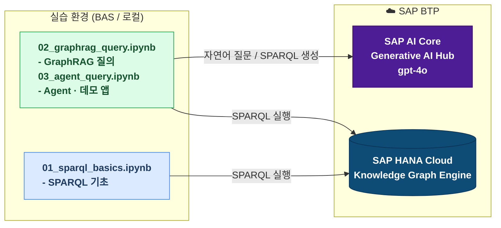
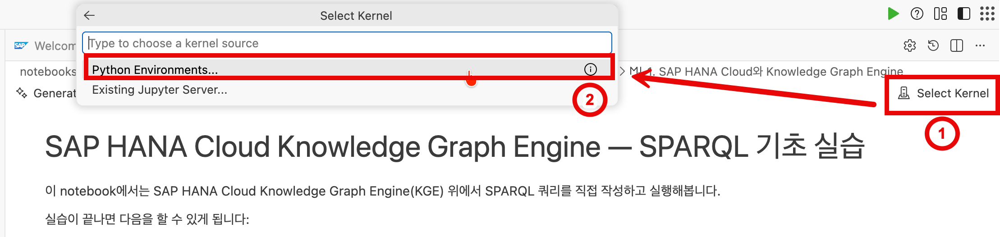
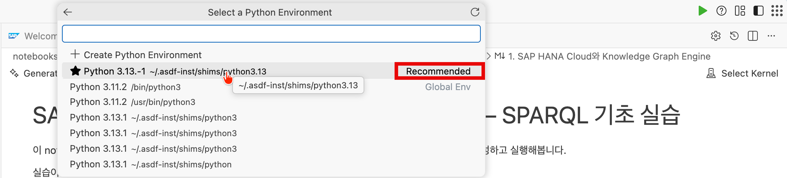

# SAP HANA Cloud KGE — GraphRAG 워크숍

SAP HANA Cloud Knowledge Graph Engine(KGE)을 직접 다뤄보고, AI Core와 연결해 자연어로 그래프에 질의하는 **GraphRAG 파이프라인**을 처음부터 끝까지 구축하는 실습 워크숍입니다.

---

## 이 워크숍을 통해 얻는 것

- SAP HANA Cloud가 관계형 DB이면서 동시에 Knowledge Graph를 지원한다는 것을 이해합니다.
- SPARQL로 그래프 데이터를 직접 조회하고 탐색할 수 있습니다.
- `langchain-hana`와 SAP AI Core를 연결해 자연어 → SPARQL → 답변의 GraphRAG 파이프라인을 구축할 수 있습니다.
- LLM이 자동으로 생성한 SPARQL을 읽고 검증할 수 있습니다.

### 왜 SPARQL을 직접 실습하나요?

요즘은 Vibe Coding으로 GraphRAG 앱을 빠르게 만들 수 있습니다. LLM이 코드를 생성해주고, Agent 형태로 조합하면 애플리케이션이 만들어집니다.

하지만 **앱의 품질은 결국 디버깅 능력에서 갈립니다.** GraphRAG에서 답변이 틀렸을 때, LLM이 만든 SPARQL이 왜 잘못됐는지 읽을 수 있어야 문제를 고칠 수 있습니다. 이 워크숍은 그 기반을 만드는 데 목적이 있습니다.

### 이 워크숍 이후에는

이 워크숍에서 배운 내용을 바탕으로, **Agent 형태의 개발만으로도 GraphRAG를 활용한 AI 애플리케이션**을 직접 만들 수 있습니다. SPARQL을 직접 작성하지 않아도 됩니다. LLM이 생성하는 쿼리의 구조를 이해하고 있으면, 더 정확하고 신뢰할 수 있는 앱을 만들 수 있습니다.

---

## 아키텍처



---

## 실습 순서

| 순서 | 내용 | 목표 | 파일 |
|------|------|------|------|
| [1] | 환경 세팅 및 repo clone | - | 아래 참고 |
| [2] | SPARQL 기초 실습 | Vibe Coding으로 만든 GraphRAG 앱이 내부적으로 실행하는 쿼리를 직접 읽고 쓸 수 있는 기반 | `notebooks/01_sparql_basics.ipynb` |
| [3] | GraphRAG 질의 실습 | 자연어 → SPARQL → 답변 파이프라인의 전체 흐름 이해. LLM이 생성한 쿼리가 틀렸을 때 어디서 왜 틀렸는지 진단하는 방법 | `notebooks/02_graphrag_query.ipynb` |
| [4] | Agent 기반 GraphRAG (Optional) | Tool을 자율적으로 호출하는 Agent 패턴 경험. 이 구조를 그대로 Vibe Coding에 가져가면 GraphRAG 앱을 바로 만들 수 있음 | `notebooks/03_agent_query.ipynb` |
| [5] | 데모 앱 실행 | Agent 패턴이 실제 Streamlit 앱으로 어떻게 동작하는지 확인 | 아래 참고 |

---

## 사전 준비

실습 환경은 두 가지 옵션 중 하나를 선택합니다. 발표자 안내에 따라 진행해주세요.

---

### Option A — 로컬 환경

아래 도구들이 설치되어 있는지 확인해주세요.

| 도구 | 설명 | 링크 |
|------|------|------|
| Python 3.10+ | 실습 전체에서 사용 | [python.org](https://www.python.org/downloads/) |
| git | repo clone에 사용 | [git-scm.com](https://git-scm.com/) |
| VS Code | 권장 에디터 | [code.visualstudio.com](https://code.visualstudio.com/) |

**VS Code Extension (권장)**
- [Python](https://marketplace.visualstudio.com/items?itemName=ms-python.python)
- [Jupyter](https://marketplace.visualstudio.com/items?itemName=ms-toolsai.jupyter)

#### 시작하기

**1. 이 repo를 clone합니다**

```bash
git clone https://github.com/claudiopark86/sap-hana-kge-graphrag-workshop.git
cd sap-hana-kge-graphrag-workshop
```

**2. 가상환경(venv)을 생성합니다**

```bash
python -m venv venv
source venv/bin/activate        # Windows: venv\Scripts\activate
pip install -r requirements.txt
```

**3. 연결 정보를 설정합니다**

```bash
cp .env.example .env
```

`.env` 파일을 열어 발표자가 배포한 값을 채워주세요. 자세한 내용은 아래 **"시작 전 준비 — 연결 정보 설정"** 섹션을 참고하세요.

**4. Jupyter Notebook을 실행합니다**

```bash
jupyter notebook
```

---

### Option B — SAP Business Application Studio (BAS)

브라우저만 있으면 별도 설치 없이 바로 실습할 수 있습니다.

**1. BAS에 접속합니다**

발표자가 배포한 접속 정보로 BAS에 로그인합니다.

> 접속 URL 및 계정 정보는 워크숍 당일 배포됩니다.

**2. Terminal을 열고 이 repo를 clone합니다**

```bash
cd ~/projects
git clone https://github.com/claudiopark86/sap-hana-kge-graphrag-workshop.git
cd sap-hana-kge-graphrag-workshop
```

**3. 연결 정보를 설정합니다**

```bash
cp .env.example .env
```

`.env` 파일을 열어 발표자가 배포한 값을 채워주세요. 자세한 내용은 아래 **"시작 전 준비 — 연결 정보 설정"** 섹션을 참고하세요.

**4. `notebooks/` 폴더에서 실습 파일을 열어 진행합니다**

각 notebook 파일을 열 때마다 Python 커널을 선택해야 합니다. 아래 순서대로 진행하세요.

**① 우측 상단 커널 선택 버튼을 클릭합니다**



**② Recommended 로 표시된 Python 환경을 선택합니다**



---

## 데모 앱 실행

`.env` 설정이 완료된 상태에서 아래 명령어를 실행합니다.

```bash
pip install -r requirements.txt
streamlit run app/app.py
```

브라우저에서 자동으로 열립니다. 열리지 않으면 터미널에 표시된 URL로 직접 접속하세요.

---

## 더 알아보기

워크숍에서 다룬 내용을 더 깊이 공부하고 싶다면 아래 자료를 참고하세요.

### SAP HANA Cloud Knowledge Graph Engine

| 자료 | 설명 |
|------|------|
| [KGE 공식 가이드](https://help.sap.com/docs/hana-cloud-database/sap-hana-cloud-sap-hana-database-knowledge-graph-guide/sap-hana-cloud-sap-hana-database-knowledge-graph-engine-guide?locale=en-US) | SAP Help Portal — KGE 전체 문서 |
| [SPARQL 레퍼런스](https://help.sap.com/docs/HANA_CLOUD_DATABASE_CN/e9188ce497ac48f6b0f1727339976805/c03aec7739f44ebc8d9bcdcee4694ce8.html?locale=en-US) | SAP Help Portal — HANA Cloud SPARQL 문법 레퍼런스 |
| [KGE 소개 (SAP Learning)](https://learning.sap.com/courses/prd-hc-introduction/k-graph) | SAP Learning — Knowledge Graph 개념 소개 |
| [KGE 데이터 모델링 (SAP Learning)](https://learning.sap.com/courses/developing-data-models-with-sap-hana-cloud/overview-the-knowledge-graph-1) | SAP Learning — HANA Cloud KGE 데이터 모델링 |

### langchain-hana

| 자료 | 설명 |
|------|------|
| [LangChain Docs — SAP HANA RDF Graph](https://docs.langchain.com/oss/python/integrations/graphs/sap_hana_rdf_graph) | `HanaRdfGraph`, `HanaSparqlQAChain` 공식 문서 |
| [SAP GitHub — langchain-hana 예제](https://github.com/SAP/langchain-integration-for-sap-hana-cloud/tree/main/examples) | `sap_hana_rdf_graph.ipynb`, `sap_hana_sparql_qa_chain.ipynb` |

---

## 시작 전 준비 — 연결 정보 설정

모든 notebook과 데모 앱은 루트의 `.env` 파일에서 연결 정보를 읽습니다.

**1. `.env.example`을 복사합니다**

```bash
cp .env.example .env
```

**2. `.env`를 열어 발표자가 배포한 값을 채웁니다**

```
HANA_HOST=your-host.hanacloud.ondemand.com
HANA_USER=your-user
HANA_PASSWORD=your-password
MY_NUMBER=XX          # 발표자가 배포한 두 자리 참가자 번호로 변경 (예: 01, 02, ... 30)
```

**3. 이후 모든 notebook과 앱이 자동으로 이 설정을 사용합니다**

> `.env` 파일은 `.gitignore`에 포함되어 있어 git에 올라가지 않습니다.

---

### SAP AI Core 설정 (02번, 03번 실습 및 데모 앱)

AI Core 연결 정보는 `.env`가 아닌 `~/.aicore/config.json`에 전역으로 설정합니다.  
이 파일이 있으면 `gen_ai_hub` SDK가 자동으로 읽어 사용합니다.

```json
{
  "AICORE_AUTH_URL": "https://...",
  "AICORE_CLIENT_ID": "...",
  "AICORE_CLIENT_SECRET": "...",
  "AICORE_BASE_URL": "https://api.ai....ml.hana.ondemand.com",
  "AICORE_RESOURCE_GROUP": "default"
}
```

- **Option A — 로컬 환경:** 아래 가이드를 참고해 `~/.aicore/config.json`을 직접 생성하세요.  
  [SAP Tutorial — Generative AI Hub with HANA Vector](https://developers.sap.com/tutorials/ai-core-genai-hana-vector.html)

- **Option B — SAP Business Application Studio (BAS):** 워크숍 사전 준비 단계에서 이미 설정이 완료되어 있습니다. 별도 작업 없이 바로 실습을 진행하시면 됩니다.

---

## 문의

워크숍 진행 중 문제가 생기면 발표자에게 문의해주세요.
